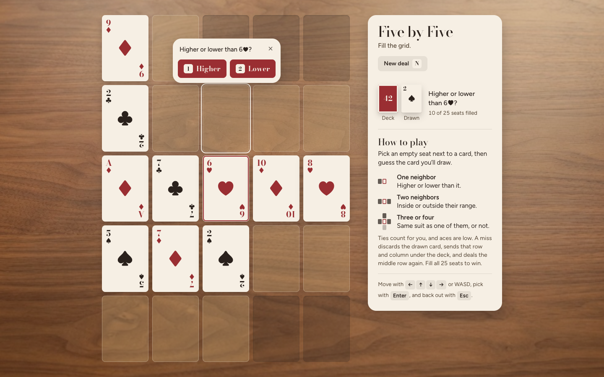
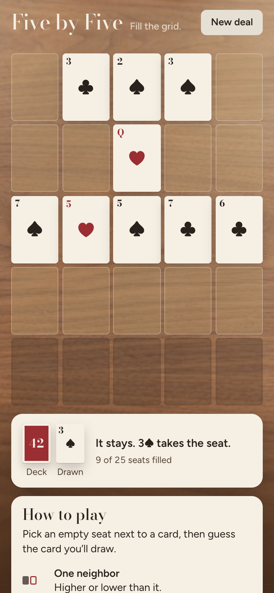

<div align="center">

# Five by Five

A card game I learned from my cousins.

[Play](#play) • [Rules](#rules) • [Controls](#controls) • [Tests](#tests)

&nbsp;

</div>

Fill a 5×5 grid of cards on a walnut dining table. Open `index.html` in a browser, or serve the folder and visit [http://127.0.0.1:8000/](http://127.0.0.1:8000/). It works on phones too, and your game is saved in the browser, so a refresh or restart picks up where you left off.

## Play

```
python3 main.py
```

> [!TIP]
> You can also open `index.html` directly. No install, no build.

## Rules

The middle row is always dealt first. Play empty seats that sit beside at least one card.

- One neighbor: guess **higher** or **lower** than that rank.
- Two neighbors: guess **inside** or **outside** the range they form.
- Three or four neighbors: guess **same** suit as a neighbor, or **different**.

Ties count for you, and aces are low. A hit places the drawn card. A miss discards the drawn card, sends that row and column to the bottom of the deck, then the middle row is refilled. Fill every seat to win.

## Controls

Click or tap an open seat next to a card, then pick your guess. On a keyboard:

| Key | Action |
| --- | --- |
| Arrow keys or WASD | Move between seats |
| Enter or Space | Pick a seat |
| 1 or 2 | Choose the first or second guess |
| Esc | Back out of a guess |
| N | Deal a new game |

## Tests

```
npm test
```

That runs the shipped-rules tests plus script-load and source checks.

The table photograph was created with Grok.
